#### Project title: Hands-on Lab: Using Git to Track and Manage Changes for a Simple Form

### Project overview

This project involves creating a simple HTML form that collects user information, including Name, Email, and Message. The main focus of this project is to demonstrate the use of Git for version control, including tracking changes, maintaining history, and reverting to previous versions when necessary.

**Prerequisites:**

* Git installed on your machine
* A basic understanding of Git commands
* An existing Github Repository
* A simple HTML form file (form.html) and a CSS file (style.css) that collects user information, including name, email, and message in a local directory

**Project Objectives**
* Develop a Funtional simple HTML form
* Apply CSS styling for the user interface
* Use Git to:
1. Track changes
2. Maintain version history
3. Manage code change safely
4. Revert to previous versions when needed

**Technologies Used**

1. HTML5 – Structure of the form
2. CSS3 – Styling and layout
3. Git – Version control system
4. GitHub repository

**Features**

* User-friendly simple form
* Input fields: Name, Email and Message
* Form validation using HTML attributes (required)
* Styled user interface
* Version tracking using Git

**screenshots**

**Create a file called simple-form.html**

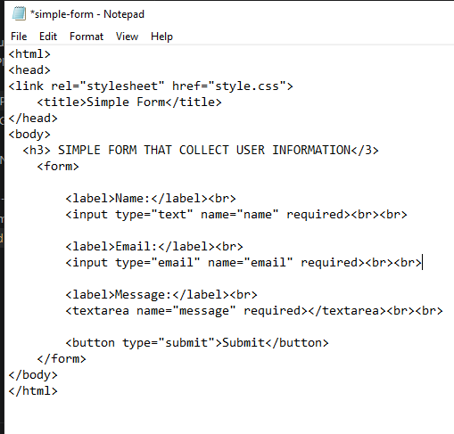

**FORM INTERFACE**

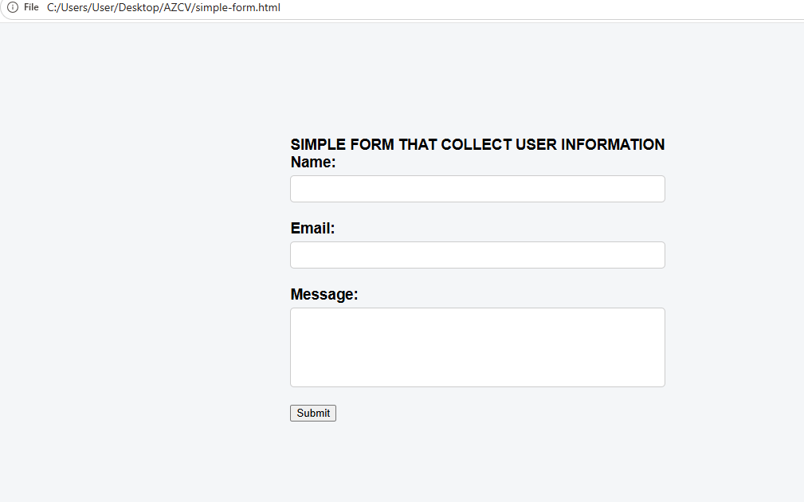

**Style sheet**

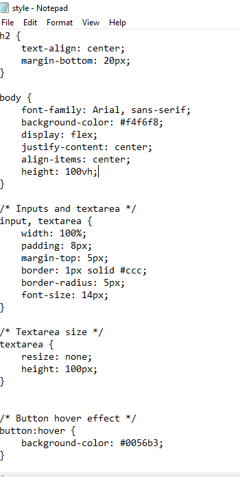

**Getting started**

1. Clone the Repository
   
</> markdown

use 'git clone git@github.com:ABDULAZEEZISAH/simple-form1.git'

**OUTPUT**

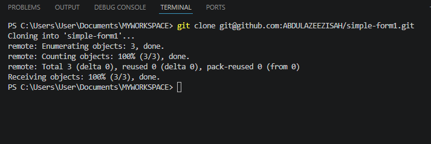

1. Navigate to Project Folder

cd simple-form-project

**Git Workflow Used**

1. Add Files
   
   </> markdown
use 'git add .'

3. Commit Changes by commit the staged files with a message:
   
use 'git commit -m "Initial commit for simple form" '

**OUTPUT**

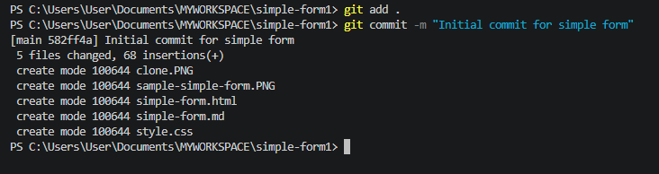

4. Push the initial commit to the remote repository:
 
 use 'git push'

 **OUTPUT**

 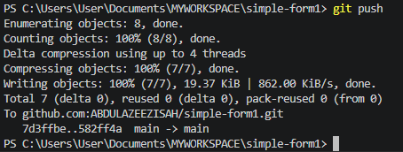

5. Make and Track Changes:

Each update (e.g., phone number update, adding CSS, validation) is committed:

use 'git add simple-form.html style.css'

use 'git commit -m "Added phone number field and updated styles"'

**OUTPUT**
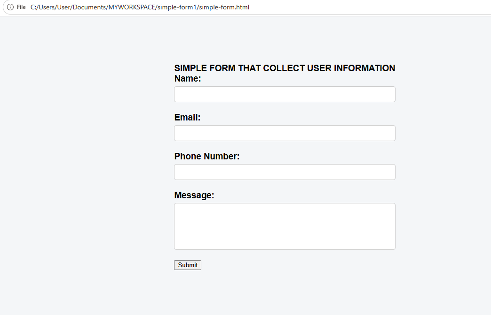

6. view the Git history to check all the changes you've made:

</> markdown
 use 'git log'

 **OUTPUT**

 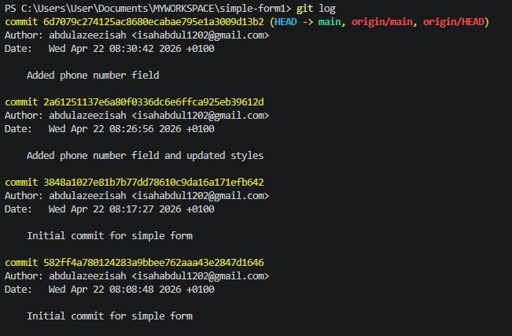

7. Revert to a Previous Version:

use 'git checkout  simple-form.html'

**OUTPUT**

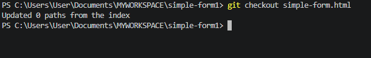

8.  Branching for New Features:

use 'git checkout -b feature-add-captcha'

**OUTPUT**

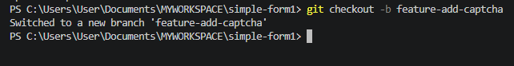

9. Make the necessary changes for the CAPTCHA feature, then stage and commit them:

use 'git add simpl-form.html'

'git commit -m "Added CAPTCHA feature"'

10. Merge the changes back into the main branch:

git checkout main
git merge feature-add-captcha

**OUTPUT**

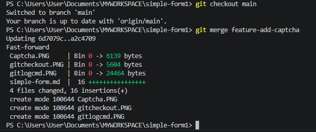

**OUTCOME:

* Clone an existing GitHub repository to your local machine.
* Track changes using commits.
* Push and pull changes to and from GitHub.
* Revert files to previous versions in case of errors.
* Manage different features with branching.